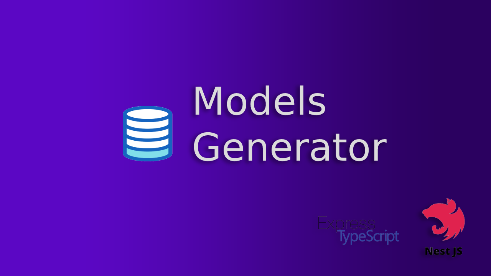

<h1 align="center">
<div align="center">
  <a href="http://nestjs.com/" target="_blank">
    
  </a>
</div>
</h1>

## Features 

- Config file generate models  
- Support for nestjs and express ts
- Generate models, interface, entities, dto from your database postgres


## Installation

**NPM**
```bash
$ npm i  models-generator-express-nestjs
```

> **Note**: Import!! This package is only for postgres, nestjs and sequalize for now


## Getting started

Once the installation process is complete,  create file config in the root project for generate models 

&nbsp;

### File configuration

```javascript
const models = require('models-generator-express-nestjs/src/index')
require('dotenv').config()
const main = async () => {
    const connection = {
      host: process.env.DATABASE_HOST || 'localhost',
      port: process.env.DATABASE_PORT || '5432',
      user: process.env.DATABASE_USER || 'user_db',
      password: process.env.DATABASE_PASSWORD || 'pass_db',
      database: process.env.DATABASE || 'your_database'
    };
    const modelsPromise = await models(connection.database, connection,'./app/modules/');
  
    const all = await Promise.all([modelsPromise]);
    process.exit();
}
```

### Add command package.json

**NPM**
```bash
 "generator": "node main.js"
```

